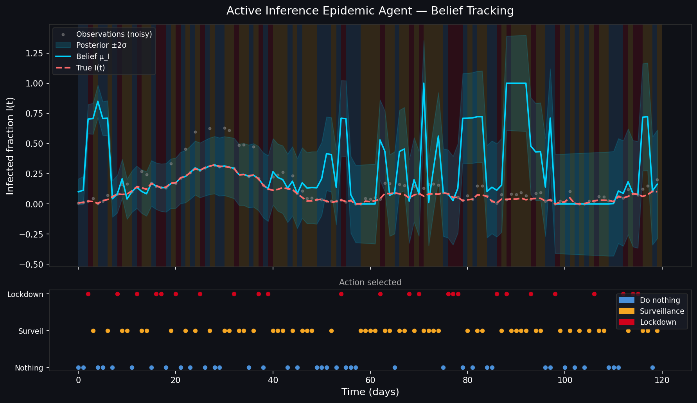
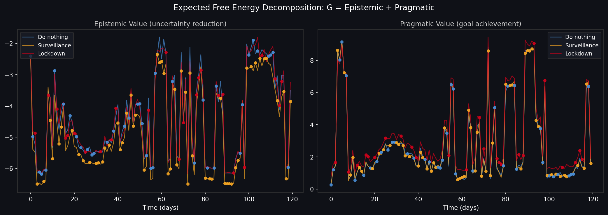
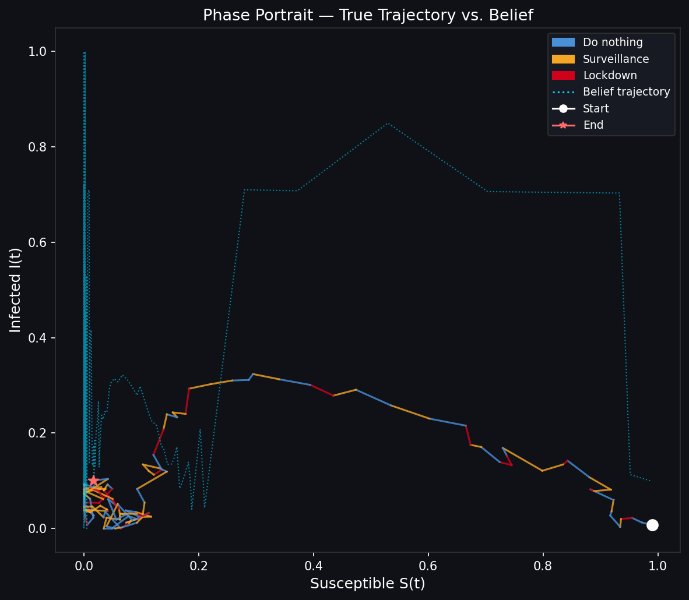
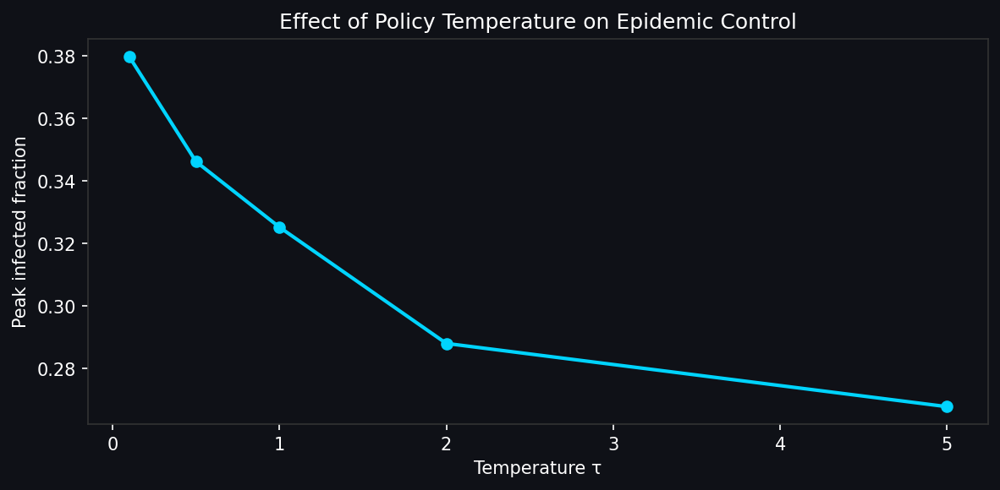
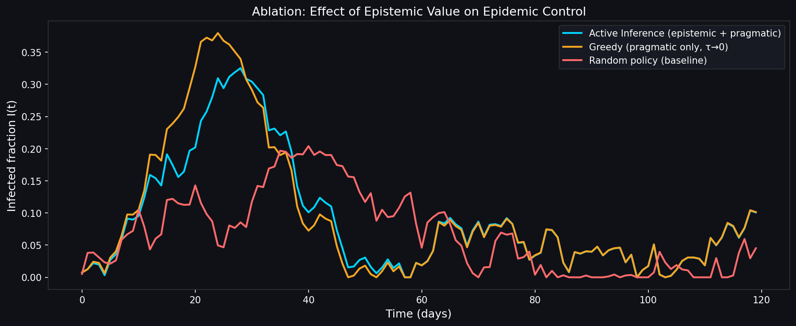

# Active Inference for Epidemic Control
### A Markov Decision Process Agent that Minimises Variational Free Energy

> *"The brain is a hypothesis testing machine... and so is the government during a pandemic."*

This repo implements an **Active Inference agent** that controls a stochastic SIR epidemic under **partial observability**. The agent never sees the true infection state, only noisy hospitalisation counts. It has to simultaneously *infer* the hidden state (perception) and *act* to control the outbreak (action), using the same mathematical objective for both.

**The core claim: perception minimises Variational Free Energy $F$ to infer the hidden epidemic state. Action selects interventions by minimising Expected Free Energy $G$, which naturally decomposes into exploring when uncertain and exploiting when not.**

---

## Table of Contents

1. [Problem Setup](#1-problem-setup)
2. [The Generative Model](#2-the-generative-model)
3. [Variational Inference and the ELBO](#3-variational-inference-and-the-elbo)
4. [Active Inference: Action via Expected Free Energy](#4-active-inference-action-via-expected-free-energy)
5. [The Exploration-Exploitation Decomposition](#5-the-exploration-exploitation-decomposition)
6. [Implementation](#6-implementation)
7. [Results](#7-results)
8. [Conclusion](#8-conclusion)
9. [Installation](#9-installation)
10. [References](#10-references)
11. [Glossary](#11-glossary)

---

## 1. Problem Setup

### The Epidemic as a POMDP

The epidemic is modelled as a **Partially Observable Markov Decision Process**. The key quantities:

- **Hidden state**: $s_t = (S_t, I_t, R_t) \in [0,1]^3$, the fractions of Susceptible, Infected and Recovered people
- **Action**: $a_t \in \{0, 1, 2\}$, do nothing / deploy surveillance / impose lockdown
- **Observation**: $o_t \sim \text{Poisson}(\rho \cdot I_t \cdot N)$, noisy hospitalisation counts normalised to rates
- **Ascertainment rate** $\rho \ll 1$: most cases are never detected

The agent sees $o_t$, never $s_t$. This is the fundamental challenge of epidemic management. If you knew the true infection fraction perfectly, the control problem would be straightforward. You don't.

### True Dynamics (Stochastic SIR)

The hidden state evolves via an Ito SDE, discretised with Euler-Maruyama:

$$dS = -\beta(a) S I \, dt + \sigma \, dW_1$$

$$dI = (\beta(a) S I - \gamma I) dt + \sigma \, dW_2$$

$$dR = \gamma I \, dt + \sigma \, dW_3$$

Parameters:
- $\beta(a) = \beta_0$ normally, $\beta_0 \cdot \lambda_{\text{ld}}$ under lockdown, lockdown reduces transmission
- $\gamma = 0.1$, recovery rate, so $1/\gamma \approx 10$ days infectious
- $\sigma = 0.02$, stochastic diffusion capturing demographic noise

---

## 2. The Generative Model

The agent holds an **internal generative model**, its beliefs about how the world works. This is separate from the true environment:

$$p(o_{1:T}, s_{1:T} \mid a_{1:T}) = p(s_0) \prod_{t=1}^{T} p(s_t \mid s_{t-1}, a_t) \cdot p(o_t \mid s_t, a_t)$$

This is just the chain rule of probability. The joint over everything equals the initial state prior, multiplied across time by the transition probability and the observation likelihood.

### Likelihood: $p(o_t \mid s_t, a_t)$

$$o_t \mid s_t, a_t \sim \mathcal{N}(\rho(a_t) \cdot I_t,\; \sigma_{\text{obs}}^2)$$

where $\sigma_{\text{obs}}^2 \approx \rho(a_t) \cdot I_t / N$ is the normalised Poisson variance. Observations are normalised by population size so inference operates on infection *rates* rather than raw counts, which keeps the gradient scaling sensible.

Surveillance doubles ascertainment: $\rho(1) = \min(\rho / \lambda_\sigma, 1)$.

### Transition Prior: $p(s_t \mid s_{t-1}, a_t)$

Linearised SIR dynamics around the current mean, plus Gaussian process noise:

$$p(s_t \mid s_{t-1}, a) = \mathcal{N}(f(s_{t-1}, a),\; Q), \quad Q = \sigma^2 \mathbf{I}$$

### Preference Model: $\tilde{p}(s)$

Active Inference encodes goals as a prior *preference* over states, not a reward function:

$$\log \tilde{p}(s) = -10 \cdot I - 0.5 \cdot \mathbf{1}[a = 2]$$

The agent strongly prefers low infections. The small lockdown penalty captures economic cost. Notice that preferences are defined over *outcomes*, not actions. Actions are never intrinsically preferred, they're chosen only because they're expected to lead to preferred states. This is a meaningful distinction from reward shaping in RL.

---

## 3. Variational Inference and the ELBO

The true posterior $p(s_t \mid o_{1:t}, a_{1:t})$ is intractable for nonlinear models. The agent approximates it with a **variational distribution** $Q_\phi(s_t)$ from a tractable family, diagonal Gaussians:

$$Q_\phi(s_t) = \mathcal{N}(\mu_t, \text{diag}(\sigma_t^2))$$

### Why a lower bound?

We want $p(s_t \mid o_t)$, but computing it directly requires:

$$p(o_t) = \int p(o_t \mid s_t) \, p(s_t) \, ds_t$$

This integral over all possible $(S, I, R)$ has no closed form for a nonlinear model like SIR. Instead of integrating, we *optimise*: find the $Q_\phi$ closest to the true posterior by maximising a lower bound on $\log p(o_t)$.

### Deriving the ELBO

**Step 1.** Since $Q(s_t)$ is a valid distribution, taking its expectation of a constant changes nothing:

$$\log p(o_t) = \mathbb{E}_{Q}[\log p(o_t)]$$

**Step 2.** Apply Bayes' rule, $p(s_t \mid o_t) = p(o_t, s_t) / p(o_t)$, to write:

$$\log p(o_t) = \log p(o_t, s_t) - \log p(s_t \mid o_t)$$

Taking expectations under $Q$:

$$\log p(o_t) = \mathbb{E}_Q[\log p(o_t, s_t) - \log p(s_t \mid o_t)]$$

**Step 3.** Add and subtract $\log Q(s_t)$, which is zero net:

$$\log p(o_t) = \mathbb{E}_Q[\log p(o_t, s_t) - \log Q(s_t) + \log Q(s_t) - \log p(s_t \mid o_t)]$$

**Step 4.** Split into two expectations:

$$\log p(o_t) = \mathbb{E}_Q[\log \frac{p(o_t, s_t)}{Q(s_t)}] + \mathbb{E}_Q[\log \frac{Q(s_t)}{p(s_t \mid o_t)}]$$

**Step 5.** Recognise the second term as a KL divergence by definition:

$$\log p(o_t) = \mathbb{E}_Q[\log \frac{p(o_t, s_t)}{Q(s_t)}] + D_{\text{KL}}[Q(s_t) \| p(s_t \mid o_t)]$$

**Step 6.** Since $D_{\text{KL}} \geq 0$, dropping it gives a lower bound on $\log p(o_t)$:

$$\log p(o_t) \geq \mathbb{E}_Q\left[\log \frac{p(o_t, s_t)}{Q(s_t)}\right]$$

**Step 7.** Expand the log of the fraction and factorise the joint $p(o_t, s_t) = p(o_t \mid s_t) \cdot p(s_t)$:

$$\mathbb{E}_Q\left[\log \frac{p(o_t, s_t)}{Q(s_t)}\right] = \mathbb{E}_Q[\log p(o_t \mid s_t)] + \mathbb{E}_Q\left[\log \frac{p(s_t)}{Q(s_t)}\right]$$

**Step 8.** The second term is $-D_{\text{KL}}(Q(s_t) \| p(s_t))$, since by definition $D_{\text{KL}}(Q \| P) = \mathbb{E}_Q[\log Q - \log P]$ :

$$\log p(o_t) \geq \underbrace{\mathbb{E}_Q[\log p(o_t \mid s_t)] - D_{\text{KL}}[Q(s_t) \| p(s_t)]}_{\text{ELBO} = \mathcal{L}(\phi)}$$

The KL here is between $Q$ and the **prior** $p(s_t)$, not the posterior $p(s_t \mid o_t)$. Those are two different KL terms on opposite sides of the identity. The ELBO has two competing forces: the likelihood term pulls $Q$ toward the data, the KL term pulls $Q$ back toward the prior. The balance between them is approximate Bayesian inference.

Flipping the sign gives the **Variational Free Energy**:

$$\boxed{F(\phi) = -\mathcal{L}(\phi) = D_{\text{KL}}[Q_\phi(s_t) \| p(s_t)] - \mathbb{E}_{Q_\phi}[\log p(o_t \mid s_t)]}$$

This is the central quantity in Active Inference. Minimising $F$ is the perception step.

### Analytic KL for Diagonal Gaussians

For $Q = \mathcal{N}(\mu_Q, \Sigma_Q)$ and $P = \mathcal{N}(\mu_P, \Sigma_P)$, both diagonal:

$$D_{\text{KL}}[Q \| P] = \frac{1}{2} \sum_{i=1}^{d} [ \frac{\sigma_{Q,i}^2}{\sigma_{P,i}^2} + \frac{(\mu_{P,i} - \mu_{Q,i})^2}{\sigma_{P,i}^2} - 1 + \log \frac{\sigma_{P,i}^2}{\sigma_{Q,i}^2} ]$$

The four terms are: variance ratio, squared mean distance normalised by prior variance, a constant, and log variance ratio. This is computed analytically in `generative_model.py`, giving exact gradients with no sampling.

### The Perception Loop

Minimise $F$ with respect to $\phi = (\mu, \log \sigma^2)$ via gradient descent:

$$\mu \leftarrow \mu - \eta_\mu \nabla_\mu F, \qquad \log \sigma^2 \leftarrow \log \sigma^2 - \eta_\sigma \nabla_{\log \sigma^2} F$$

JAX's `value_and_grad` computes $F$ and its gradients in one pass. See `inference.py`.

---

## 4. Active Inference: Action via Expected Free Energy

Minimising $F$ gives beliefs about the current state. But how does the agent choose actions?

In RL, the agent maximises expected reward. In Active Inference, the agent minimises **Expected Free Energy** $G(a)$, the free energy it expects to experience if it takes action $a$:

$$G(a) = \mathbb{E}_{Q(o', s' \mid a)}[\log Q(s' \mid a) - \log \tilde{p}(o', s')]$$

where $\tilde{p}$ is the preference model and $Q(s' \mid a)$ is the predicted belief after taking action $a$. The expectation is over future states and observations under the current belief. Expanding this gives:

$$G(a) = \underbrace{-\mathbb{E}_{Q(s'\mid a)}[H[p(o' \mid s', a)]]}_{\text{Epistemic value}} + \underbrace{D_{\text{KL}}[Q(s' \mid a) \| \tilde{p}(s')]}_{\text{Pragmatic value}}$$

The agent then samples actions according to a softmax over $G$:

$$\pi(a) \propto \exp(-G(a) / \tau)$$

where $\tau$ is a temperature parameter. Lower $G$ means higher probability, the agent prefers actions it expects to be less surprising and more goal-directed.

---

## 5. The Exploration-Exploitation Decomposition

This is the key result. $G(a)$ decomposes into two terms that correspond to exploration and exploitation, and nobody wrote a bonus or a heuristic to make this happen.

### Epistemic Value (Exploration)

$$G_{\text{epistemic}}(a) = -\mathbb{E}_{Q(s'\mid a)}[H[p(o' \mid s', a)]]$$

This is the negative expected entropy of future observations. Entropy measures uncertainty, so this term rewards actions expected to produce *informative* observations. Surveillance ($a=1$) doubles the ascertainment rate, producing sharper observations with lower entropy, so its epistemic $G$ is lower, making it more likely to be selected when the state is uncertain.

### Pragmatic Value (Exploitation)

$$G_{\text{pragmatic}}(a) = D_{\text{KL}}[Q(s' \mid a) \| \tilde{p}(s')]$$

This measures how far the predicted future state is from the preferred state. Lockdown ($a=2$) reduces $\beta$, which drives $I$ toward 0, which is close to $\tilde{p}$, so its pragmatic $G$ is lower at peak infection.

The critical point: you never hand-coded "explore sometimes". The tension emerges from minimising a single quantity.

| Phase | Dominant drive | What the agent does |
|-------|----------------|-------------------|
| Early outbreak, high uncertainty | Epistemic | Deploy surveillance |
| Peak, high $I$, certain | Pragmatic | Impose lockdown |
| Recovery, low $I$, low uncertainty | Neither | Do nothing |

---

## 6. Implementation

### Architecture

```
active-inference-epidemic/
├── src/
│   ├── environment.py       # True SIR POMDP, observation model
│   ├── generative_model.py  # Agent's internal model, BeliefState, F
│   ├── inference.py         # Perception: gradient descent on F
│   ├── agent.py             # Action: G computation, softmax policy
│   └── simulate.py          # Episode runner, ablation utilities
├── notebooks/
│   └── exploration.ipynb    # Experiments and figure generation
└── results/                 # Saved figures
```

### Stack

- **JAX** for autodifferentiation on $\nabla_\phi F$, JIT compilation, functional purity
- **NumPy / Matplotlib** for storage and visualisation
- No deep learning frameworks. This is mathematical inference, not neural approximation.

### Key design choices

- Diagonal Gaussian posterior: tractable, analytic KL, differentiable parameters
- Euler-Maruyama SDE: captures demographic stochasticity without a full agent-based model
- Monte Carlo EFE: $G(a)$ approximated by sampling from $Q(s' \mid a)$, clean and general
- JAX `value_and_grad`: single-pass gradient computation, no manual backprop

---

## 7. Results

### Belief Tracking

The agent tracks the hidden infection curve from noisy hospitalisation counts, locking onto the true state within a few steps despite an ascertainment rate of only $\rho = 0.15$. The uncertainty band widens again in the endemic tail where infection is low and observations are sparse, which is the correct Bayesian behaviour: less data, more uncertainty.



### Expected Free Energy Decomposition

The epistemic and pragmatic components of $G$ tell different stories. The epistemic term (left) is high early when the state is uncertain and drops as the agent accumulates evidence, surveillance is consistently preferred here. The pragmatic term (right) peaks sharply around day 25 when infection is highest, driving lockdown. The two drives are active at different phases of the epidemic without any hand-coded switching logic.



### Phase Portrait

The belief trajectory (dashed) closely follows the true $(S, I)$ curve in phase space despite never observing $S$ or $I$ directly. The chaotic cluster near the origin reflects the endemic tail where the agent repeatedly re-estimates a near-zero infection fraction from noisy observations.



### Effect of Policy Temperature

Higher temperature $\tau$ leads to a lower peak infection fraction, which is counterintuitive at first: a more stochastic policy outperforms a greedy one. The reason is that at low $\tau$ the agent over-commits to exploitation before the state is well-estimated, whereas higher $\tau$ preserves enough exploration to gather information early and intervene more effectively.



### Ablation: Value of Epistemic Component

The full Active Inference agent (epistemic + pragmatic) achieves a substantially lower peak than the greedy agent ($\tau \to 0$, pragmatic only), confirming that the epistemic drive contributes meaningfully to epidemic control rather than just being a theoretical nicety. The random baseline performs surprisingly well in the early phase due to accidental surveillance, but fails to sustain suppression.



---

## 8. Conclusion

The results show that framing epidemic control as variational inference rather than reward maximisation produces an agent that naturally balances information-gathering and intervention without any explicit exploration bonus. 

The exploration-exploitation decomposition emerging from a single mathematical objective ($G$) rather than from engineering, suggests that Active Inference may be a principled alternative to RL in any sequential decision problem where the hidden state is partially observable and costly to probe. 

The belief tracking results confirm the perception half: minimising $F$ recovers the hidden infection curve from observations capturing less than 15% of true cases. The G decomposition and ablation confirm the action half: selecting interventions by minimising $G$ produces an agent that deploys surveillance when uncertain and locks down when not, without any explicit exploration bonus.

More broadly, the framework points toward public health policies that are uncertainty-aware by construction: a government minimising Expected Free Energy would **deploy surveillance** when the **state is unknown** (high epistemic value), and **intervene** when it is **known and bad** (high pragmatic cost).


---

## 9. Installation

```bash
git clone https://github.com/sumayyamanji/mdp_epidemic
cd mdp_epidemic
pip install jax jaxlib numpy matplotlib jupyter
```

Run a single episode:

```bash
cd src
python simulate.py
```

Generate all figures by running `notebooks/exploration.ipynb` cell by cell.

---

## 10. References

- Friston, K. et al. (2017). Active inference and epistemic value. *Cognitive Neuroscience*, 8(4), 187-214.
- Parr, T. and Friston, K. (2019). Generalised free energy and active inference. *Biological Cybernetics*, 113(5-6), 495-513.
- Da Costa, L. et al. (2020). Active inference on discrete state-spaces: A synthesis. *Journal of Mathematical Psychology*, 99, 102474.
- Wainwright, M. and Jordan, M. (2008). Graphical models, exponential families, and variational inference. *Foundations and Trends in Machine Learning*, 1(1-2), 1-305.
- Kermack, W. O. and McKendrick, A. G. (1927). A contribution to the mathematical theory of epidemics. *Proceedings of the Royal Society A*, 115(772), 700-721.
- Bottemanne, H. and Friston, K.J. (2021). An active inference account of protective behaviours during the COVID-19 pandemic. *Cognitive, Affective, and Behavioral Neuroscience*, 21(5), 1117-1129.
- Wood, F. et al. (2022). Planning as Inference in Epidemiological Dynamics Models. *Frontiers in Artificial Intelligence*, 4, 550603.

---

*Built as a demonstration that the mathematics of Bayesian brain theory (Friston's Free Energy Principle) applies directly to public health decision-making.*

---

## 11. Glossary

**Ascertainment rate** $\rho$: the fraction of true infections that are actually detected and recorded as hospitalisations. In practice $\rho \ll 1$, most cases go unobserved.

**Belief state** $Q_\phi(s_t)$: the agent's current probability distribution over the hidden state. Represented as a diagonal Gaussian with parameters $\phi = (\mu, \log \sigma^2)$.

**ELBO (Evidence Lower Bound)** $\mathcal{L}(\phi)$: a lower bound on the log marginal likelihood $\log p(o_t)$. Maximising it is equivalent to minimising Variational Free Energy.

**Expected Free Energy** $G(a)$: the free energy the agent expects to experience under action $a$. Decomposes into epistemic value (uncertainty reduction) and pragmatic value (goal achievement). Action selection minimises $G$.

**Epistemic value**: the component of $G$ that rewards actions expected to reduce uncertainty about the hidden state. Drives exploration and surveillance behaviour.

**Generative model**: the agent's internal model of how observations are caused by hidden states, $p(o_t \mid s_t, a_t)$, and how states evolve, $p(s_t \mid s_{t-1}, a_t)$. Distinct from the true environment.

**KL divergence** $D_{\text{KL}}[Q \| P]$: a measure of how different distribution $Q$ is from distribution $P$. Always non-negative, equals zero only when $Q = P$. Defined as $\mathbb{E}_Q[\log Q - \log P]$.

**Partial observability**: the agent cannot observe the true state $s_t = (S_t, I_t, R_t)$ directly, only the noisy hospitalisation count $o_t$.

**POMDP (Partially Observable Markov Decision Process)**: a decision-making framework where the agent acts in a Markov environment but only receives noisy, incomplete observations of the true state.

**Pragmatic value**: the component of $G$ that rewards actions expected to bring the future state closer to the agent's preferences. Drives exploitation and lockdown behaviour at peak infection.

**Preference model** $\tilde{p}(s)$: encodes the agent's desired outcomes as a prior over states. Replaces the reward function from RL. Goals are achieved by minimising the KL between the predicted future and this prior.

**Surprise**: $-\log p(o_t)$, the negative log probability of an observation under the agent's model. High surprise means the observation was unexpected. Variational Free Energy is a tractable upper bound on surprise.

**Variational Free Energy** $F$: a tractable upper bound on surprise, $F \geq -\log p(o_t)$. The central objective in Active Inference. Minimising $F$ performs approximate Bayesian inference by balancing the likelihood of observations against the KL from the prior.

**Variational inference**: approximating an intractable posterior $p(s_t \mid o_t)$ with a tractable distribution $Q_\phi(s_t)$ by optimising the parameters $\phi$ to minimise $F$.
